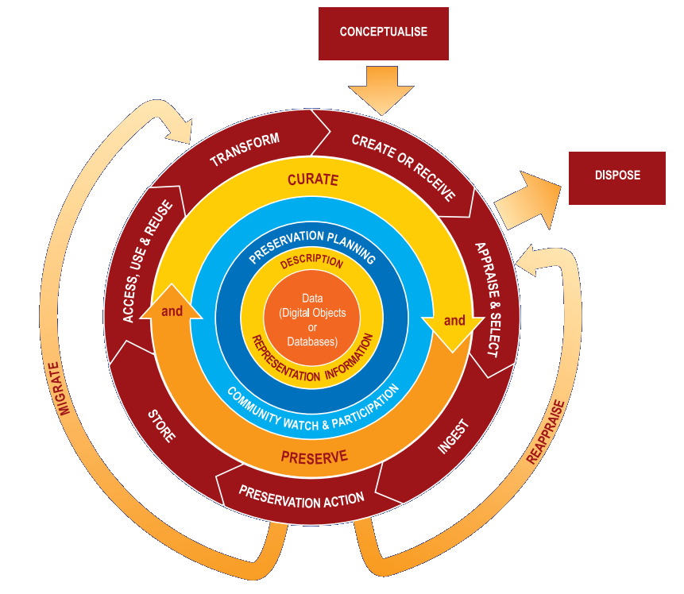
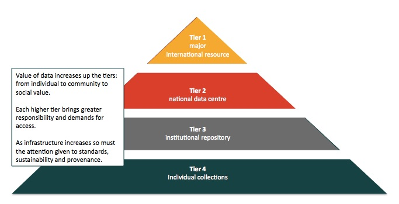
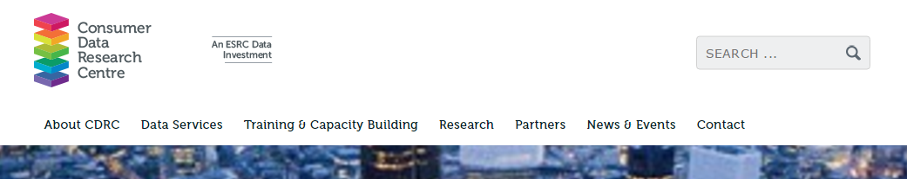
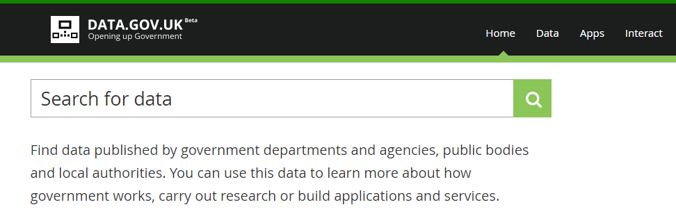
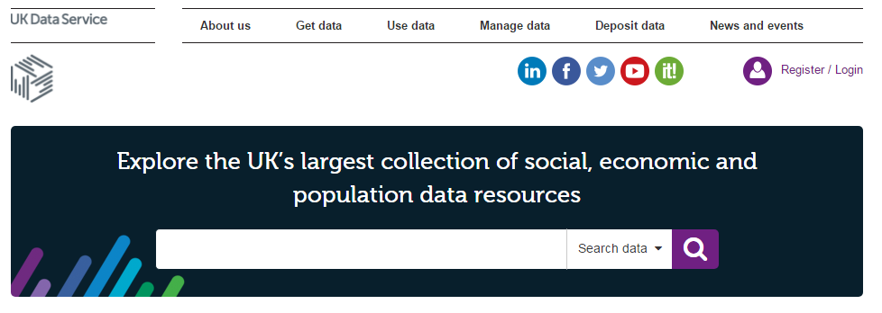

```{r setup, include=FALSE}
knitr::opts_chunk$set(echo = TRUE)
```

## Data Life Cycle

- Over the past decade, there has been an increase in the amount of data being made **publicly available**
- **Data curation** allows for the **re-use** of previously generated data for new purposes
- This provides researchers with access to a wealth of **secondary data sources**

```{r, out.height="300", out.width="400", echo=FALSE, fig.align='center'}

```

## Data Stores

- Data can be stored in a number of different repositories, ranging from **personal collections to international archives**
- As data moves up the storage hierarchy, it generally **increases in reach**
- The presence of **national data centres** has expanded significantly

```{r, out.height="300", out.width="500", echo=FALSE, fig.align='center'}

```

## National Data Centres

- A number of centres of UK data have now been established

```{r, echo=FALSE, fig.align='center'}

```
```{r, echo=FALSE, fig.align='center'}

```
```{r, echo=FALSE, fig.align='center'}

```

## Recommended sites for transport data

- Wicid for open orgin-destination data: http://wicid.ukdataservice.ac.uk/
- Official boundary is very important - can be found on OSM in some places but in the UK best from the 'geoportal': http://geoportal.statistics.gov.uk/
- OSM for GPS AND transport infrastructure data: http://wiki.openstreetmap.org/wiki/Downloading_data
- Many local and national authorities, e.g TfL: https://tfl.gov.uk/info-for/open-data-users/
- Academic research projects, e.g. the Propensity to Cycle Tool (PCT): http://pct.bike/manual.html

## Challenge: download and visualise some large datasets (10 MB+)

> - Ensure your dataset is different from your neighbours'
> - How did you search for your dataset?
> - Any issues saving/loading the data?
> - Discussion: what are the strengths and weaknesses of this dataset?
> - How could this dataset be improved (e.g. by 'data linkage')?

