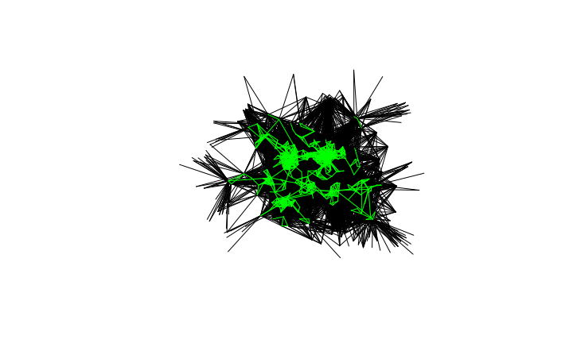
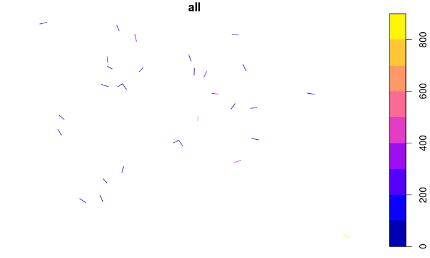

# Data carpentry for sustainable transport planning: the Propensity to Cycle Tool
Robin Lovelace, University of Leeds, 
 `r Sys.Date()`  
Slides: [rpubs.com/RobinLovelace](http://rpubs.com/RobinLovelace)  

## The nature of transport data

- The same as handling any other kind of data in R
- But: dynamic, complex (e.g. GTFS) reliant on official feeds
- That's why using a language that is powerful and flexible is good

## Worked example: pct data in West Yorksire

- We'll download and visualise some transport data


```r
# u_pct = "https://github.com/npct/pct-data/raw/master/west-yorkshire/l.Rds"
# download.file(u_pct, "l.Rds")
library(stplanr)
```

```
## Loading required package: sp
```

```r
l = readRDS("l.Rds")
plot(l)
```

<!-- -->

## Analysing where people walk


```r
sel_walk = l$foot > 9
l_walk = l[sel_walk,]
plot(l)
plot(l_walk, add = T, col = "red")
```

<!-- -->

```r
library(dplyr) # for next slide...
```

```
## 
## Attaching package: 'dplyr'
```

```
## The following objects are masked from 'package:stats':
## 
##     filter, lag
```

```
## The following objects are masked from 'package:base':
## 
##     intersect, setdiff, setequal, union
```

## Doing it with sf (!)


```r
l_walk1 = l %>% filter(All > 10) # fails
```


```r
library(sf)
```

```
## Linking to GEOS 3.5.1, GDAL 2.2.1, proj.4 4.9.2, lwgeom 2.3.3 r15473
```

```r
l_sf = st_as_sf(l)
plot(l_sf[6])
```

<!-- -->

## Subsetting with sf | is really fun!


```r
l_walk2 = l_sf %>% 
  filter(foot > 9)
plot(l_sf$geometry)
plot(l_walk2$geometry, add = T, col = "green")
```

<!-- -->


## Exercises | Use sf or sp depending on what you want

- Find and plot all desire lines where cycling is more common than walking 
- Find all desire which are less than 2.5 km 
- Find all lines in which driving is more common than walking AND are 
- Find and plot all desire lines that are longer. Where are they?
- Use the following code to download bus stops in the area

## Solution


```r
l_sf$distsf = as.numeric(st_length(l_sf))
summary(l_sf$distsf)
```

```
##    Min. 1st Qu.  Median    Mean 3rd Qu.    Max. 
##   589.7  5204.3  8343.3  8910.0 12238.3 20034.3
```

```r
l_drive_short = l_sf %>% 
  filter(distsf < 1000 & car_driver > foot)
l_drive_short2 = l_sf %>% 
  filter(distsf < 1000) %>% 
  filter(car_driver > foot)
l_short = l_sf %>% 
  filter(distsf < 1000)
plot(l_drive_short[6])
```

<!-- -->


```r
devtools::install_github("osmdatar/osmdata")
```


## Advanced challenge: download transport data with osmdata 

- You'll need to read-up on the osmdata vignette


```r
library(osmdata)
```

```
## Data (c) OpenStreetMap contributors, ODbL 1.0. http://www.openstreetmap.org/copyright
```

```r
q = opq(bbox = "Leeds") %>% 
  add_feature(key = "railway", value = "station")
```

```
## add_feature() is deprecated; please use add_osm_feature()
```

```r
stations = osmdata_sf(q = q)
plot(l_sf[6])
```

<!-- -->

```r
plot(stations$osm_points, add = T)
```

```
## Warning in plot.sf(stations$osm_points, add = T): ignoring all but the
## first attribute
```

<!-- -->
